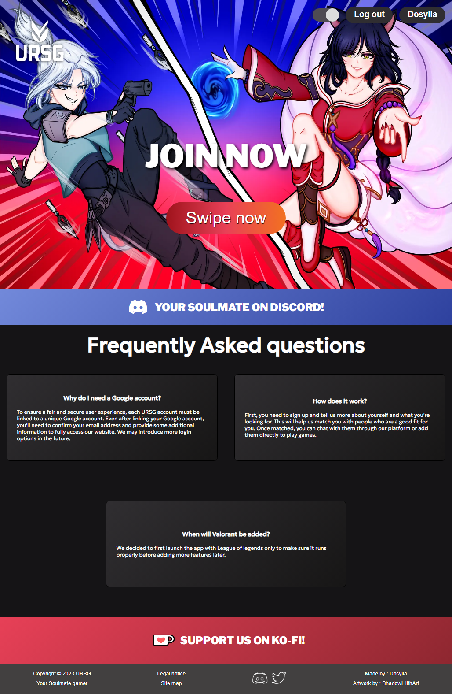

# URSG/MVC - Your soulmate Gamer

## What this project is for?
Actually remaking a finished project but in MVC to have a code lot more clean and optimized with the new knowledge acquired by my other projects.

## Description

URSG is a website made so gamers (LoL/Valorant) can meet and play together. It includes a friendlist, chat, block.
It also use the Riot Games database to display accounts of users that accept it and Google API for the login part using Ajax to create their account.

## Technologies

- HTLM
- CSS
- Javascript
- PHP
- SQL

## Hosted result of project

https://ur-sg.com/

## How to Contribute

Contact me on my portfolio : https://www.dosylia.com/  
Or you can help with the development of the project by reporting [issues](https://github.com/Dosylia/URSGMVC/issues) or forking the project and creating [pull requests](https://github.com/Dosylia/URSGMVC/pulls).  
Feedback can also be posted in the [URSG Discord server](https://discord.gg/Bfpkws74V3)!
